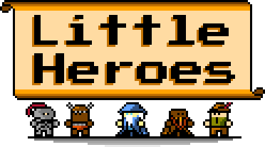

# Little Heroes

Little heroes is a minimalistic asset pack meant to built retro looking,
NES era inspired RPGs.

You can download the pack from our Ko-fi shop [here](https://ko-fi.com/s/6e1d3c7e5f), or just
get them from this repository on the `renders` folder.

It is also a game that serves to both apply the Asset Pack into a realistic
game, and also make use of our other project [Nes UI](https://github.com/erickzanardo/nes_ui),
You can check the game at https://cherrybit.studio/little_heroes.

For now the game is super simple and includes only a party editor menu, with more
features coming out as the asset pack has progress.
